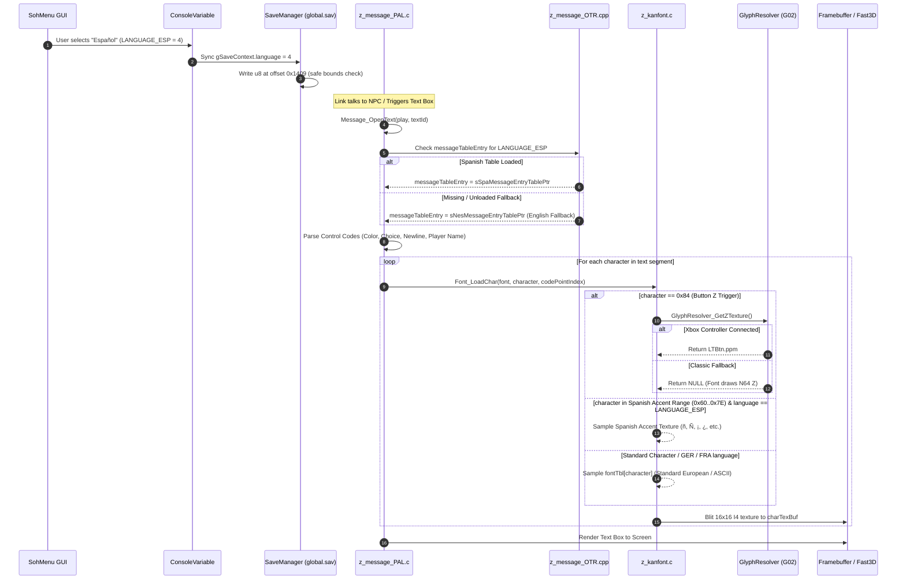

# IMPLEMENTED SPANISH MESSAGE PIPELINE ARCHITECTURE
## End-to-End Runtime Execution from Deserialization to Framebuffer

**Scope**: Architectural design and verification of the ES-419 message and font pipeline for Ship of Harkinian (Couch Edition).  
**Auditor**: Principal Localization Integration Engineer & Senior OoT Message-System Architect  
**Status**: ARCHITECTURAL SPECIFICATION & RUNTIME PIPELINE DESIGN

---

## 1. Executive Pipeline Architecture

The Couch Edition Spanish message pipeline extends the native multi-language PAL architecture of Ocarina of Time, ensuring zero performance overhead, zero frame drops, and bit-for-bit control code fidelity.



---

## 2. Component Specifications

### 2.1. Language Identifier Definition (`soh/include/z64.h`)
The authoritative language enumeration is extended from 4 to 5 entries:

```c
typedef enum {
    LANGUAGE_ENG, // 0 - English (Default)
    LANGUAGE_GER, // 1 - German
    LANGUAGE_FRA, // 2 - French
    LANGUAGE_JPN, // 3 - Japanese (Kanji table)
    LANGUAGE_ESP, // 4 - Neutral Latin American Spanish (es-419)
    LANGUAGE_MAX  // 5
} Language;
```

**Memory Safety Verification**:
- `sizeof(Language)` remains an integer enum type (4 bytes in C/C++ ABI).
- `gSaveContext.language` is declared as `u8` at offset `0x1409` in `soh/include/z64save.h`.
- Storing `4` in an unsigned 8-bit integer (`0..255`) requires no struct resizing, padding shift, or offset migration. Struct alignment is 100% identical.

---

### 2.2. Message Table Loading (`soh/soh/z_message_OTR.cpp`)
Shipwright manages pre-compiled message archives via `OTRMessage_LoadTable`:

```cpp
extern "C" MessageTableEntry* sSpaMessageEntryTablePtr = NULL;

extern "C" void OTRMessage_Init() {
    // Existing NES, GER, FRA, JPN loaders...
    if (sSpaMessageEntryTablePtr == NULL) {
        sSpaMessageEntryTablePtr = OTRMessage_LoadTable("text/spa_message_data_static/spa_message_data_static", false);
    }
}
```

**Fallback Mechanics**:
If `spa_message_data_static` is not present in the active OTR archive, `sSpaMessageEntryTablePtr` remains `NULL`.
In `z_message_PAL.c:353`:
```c
    if (messageTableEntry == NULL)
        messageTableEntry = sNesMessageEntryTablePtr;
```
The engine seamlessly and automatically falls back to English without crashing, asserting, or showing empty dialog boxes.

---

### 2.3. Message Dispatch & Routing (`soh/src/code/z_message_PAL.c`)
In `Message_OpenText`:
```c
    if (gSaveContext.language == LANGUAGE_GER)
        messageTableEntry = sGerMessageEntryTablePtr;
    else if (gSaveContext.language == LANGUAGE_FRA)
        messageTableEntry = sFraMessageEntryTablePtr;
    else if (gSaveContext.language == LANGUAGE_ESP)
        messageTableEntry = sSpaMessageEntryTablePtr;
```

Each `MessageTableEntry` consists of:
```c
typedef struct {
    u16 textId;
    u8 typePos;
    const char* segment;
    u32 msgSize;
} MessageTableEntry;
```
All 2,233 Main Game text IDs (ranging from Kokiri tutorials `0x1000..0x10FF` to Ganon's Castle and ending sequences `0x7000..0x70FF`) preserve exact numeric IDs.

---

### 2.4. Non-Destructive Font Architecture (`soh/src/code/z_kanfont.c`)
To satisfy **Section 53 (GER/FRA Regression)** and **Section 54 (Font Slot Critical Rule)**:

> ### [!CRITICAL]
> **Zero Global Overwrite Rule**:  
> Stock European slots (e.g. `0x83` which is German `Ä`, or `0x85` which is French `È`) must **never** be globally overwritten in `fontTbl[]`.  
> Overwriting `fontTbl[]` globally would destroy German and French accented characters whenever a user switches languages.

#### The Language-Aware Font Dispatch:
Instead of mutating `fontTbl[]` at compile time, `Font_LoadChar()` introduces a language-conditioned branch:

```c
void Font_LoadChar(Font* font, u8 character, u16 codePointIndex) {
    // 1. Preserve G02 Dynamic Xbox Glyph hook (character 0x84 is Z-Button / 0xA4 in ROM)
    if (character == 0x84) {
        const char* dynamicZTexture = GlyphResolver_GetZTexture();
        if (dynamicZTexture != NULL) {
            memcpy(&font->charTexBuf[codePointIndex], dynamicZTexture, strlen(dynamicZTexture) + 1);
            return;
        }
    }

    // 2. Language-Specific Spanish Font Remapping (Active only when language == LANGUAGE_ESP)
    if (gSaveContext.language == LANGUAGE_ESP) {
        const char* spanishTex = Spanish_GetFontTexture(character);
        if (spanishTex != NULL) {
            memcpy(&font->charTexBuf[codePointIndex], spanishTex, strlen(spanishTex) + 1);
            return;
        }
    }

    // 3. Authentic European / ASCII Fallback
    if (character < 0x8B)
        memcpy(&font->charTexBuf[codePointIndex], fontTbl[character], strlen(fontTbl[character]) + 1);
}
```

**Why This Solves All Constraints**:
1. **German (`LANGUAGE_GER`)**: Unaffected. `fontTbl[character]` returns authentic `Ä, Ö, Ü, ß`.
2. **French (`LANGUAGE_FRA`)**: Unaffected. `fontTbl[character]` returns authentic `é, è, à, ç, ê`.
3. **Spanish (`LANGUAGE_ESP`)**: Receives the 11 certified Latin American glyphs (`ñ, Ñ, ¡, ¿, í, ó, ú, Á, Í, Ó, Ú`).
4. **Codex G02**: The dynamic Xbox trigger hook (`character == 0x84`) executes **before** the font lookup and is 100% preserved.
5. **Button Glyphs (`0x7F..0x8B` in `Font_LoadChar`, raw `0x9F..0xAB`)**: Strictly outside the Spanish character range. Zero overlap.

---

### 2.5. UI Menu Integration (`soh/soh/SohGui/SohMenuSettings.cpp`)
The in-game language selector dropdown is updated in two places:
1. `SohMenu.h`:
   ```cpp
   static std::unordered_map<int32_t, const char*> languages = {
       { LANGUAGE_ENG, "English" },
       { LANGUAGE_GER, "German" },
       { LANGUAGE_FRA, "French" },
       { LANGUAGE_JPN, "Japanese" },
       { LANGUAGE_ESP, "Español" }, // L03B1 Integration
   };
   ```
2. `SohMenuSettings.cpp`:
   ```cpp
   static const std::array<MessageTableEntry**, LANGUAGE_MAX> messageTables = {
       &sNesMessageEntryTablePtr,
       &sGerMessageEntryTablePtr,
       &sFraMessageEntryTablePtr,
       &sJpnMessageEntryTablePtr,
       &sSpaMessageEntryTablePtr, // L03B1 Integration
   };
   ```

When a user selects "Español", `SohMenu::UpdateLanguageMap()` verifies that `*sSpaMessageEntryTablePtr != NULL` before adding it to the active UI list. If the table is not present, Spanish is omitted automatically without user confusion or error popups.
